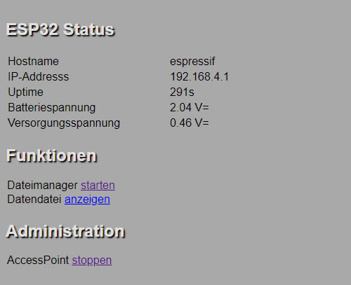
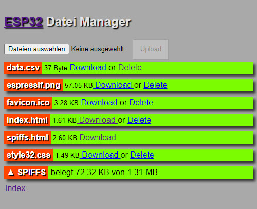

# LoLin_StandAloneMeasurements
## Intro
Simple PoC to show, how an ESP32 can be used to measure and store various sensor data independent of any external memory powered by a small LiPo battery.

The PoC is shown an a cheap ESP32 board from Amazon 
- AZDelivery LOLIN32 Lite Board V1.0 mit ESP-32 Rev1
- https://www.amazon.de/dp/B086V1P4BL/ref=cm_sw_em_r_mt_dp_QQ07ED0R9V66EXNRK0ZA?_encoding=UTF8&psc=1

## Data aquisition and storage
A number of data points is stored in RTC-memory of the ESP32. If its limit is exceeded the data is appended to the flash filesystem in the ESP32.
The data is stored as CSV-based text file in the file "data.csv". This is a measure to reduce the wear of the flash memory of the ESP32.

Currentyl the following data aquisition is done after the device wakes up by the timer:
- The attached DHT22 sensor is read. Check its configuration in the file [measure.h](measure.h).
- Then the two ADC channels (battery voltage and supply voltage) are read by the corresponding functions in measure.cpp(readVbatt() and readVsupp()). Here also the scaling is done according the external voltage deviders.
- Eachs measurements contains a timestamp (seconds since last HW reset). This is a rough estimation controller by the 150kHz internal clock source of the ESP32

## Data access
The file can be accessed via an integrated simple webserver.
The webserver is started via a hardware pushbutton GPIO_NUM_13 and listens on http://192.168.4.1.
To revert back to data aquisition in low power mode, the webserver must be terminated via the web interface.

## serial logging
To enable serial logging add "#define DEBUGGING" in data.h.
### log on RESET
``` C
18:57:03.910 -> ets Jun  8 2016 00:22:57
18:57:03.910 -> 
18:57:03.910 -> rst:0x5 (DEEPSLEEP_RESET),boot:0x1b (SPI_FAST_FLASH_BOOT)
18:57:03.910 -> configsip: 0, SPIWP:0xee
18:57:03.910 -> clk_drv:0x00,q_drv:0x00,d_drv:0x00,cs0_drv:0x00,hd_drv:0x00,wp_drv:0x00
18:57:03.910 -> mode:DIO, clock div:1
18:57:03.910 -> load:0x3fff0018,len:4
18:57:03.910 -> load:0x3fff001c,len:1044
18:57:03.910 -> load:0x40078000,len:10124
18:57:03.910 -> load:0x40080400,len:5856
18:57:03.910 -> entry 0x400806a8
18:57:04.233 -> 
18:57:04.233 -> 
18:50:08.398 -> ===================================================================================
18:50:08.444 -> Build file   [...\LoLin_StandAloneMeasurements_V2.ino]
18:50:08.444 -> Build date   [May 24 2021 18:47:01]
18:50:08.444 -> Boot number  [1]
18:50:08.444 -> Wakeup caused by reset
18:50:08.537 -> Flash file system started
18:50:08.537 -> Buffers initialized
18:50:08.585 -> Error reading temperature!
18:50:08.769 -> 0 / 0
18:50:08.769 ->  Temp=-99.0
18:50:08.769 ->  Humi= 0.0
18:50:08.769 ->  Vsup=0.00
18:50:08.769 ->  Vbat=0.00
18:50:08.769 -> Going into deepsleep mode for 60s...
18:50:08.815 -> ^^^^^^^^^^^^^^^^^^^^^^^^^^^^^^^^^^^^^^^^^^^^^^^^
18:50:08.815 -> 
18:50:08.815 -> 
```
### log in timer overrun
``` C
18:57:03.910 -> ets Jun  8 2016 00:22:57
18:57:03.910 -> 
18:57:03.910 -> rst:0x5 (DEEPSLEEP_RESET),boot:0x1b (SPI_FAST_FLASH_BOOT)
18:57:03.910 -> configsip: 0, SPIWP:0xee
18:57:03.910 -> clk_drv:0x00,q_drv:0x00,d_drv:0x00,cs0_drv:0x00,hd_drv:0x00,wp_drv:0x00
18:57:03.910 -> mode:DIO, clock div:1
18:57:03.910 -> load:0x3fff0018,len:4
18:57:03.910 -> load:0x3fff001c,len:1044
18:57:03.910 -> load:0x40078000,len:10124
18:57:03.910 -> load:0x40080400,len:5856
18:57:03.910 -> entry 0x400806a8
18:57:04.233 -> 
18:57:04.233 -> 
18:57:04.233 -> ===================================================================================
18:57:04.233 -> Build file   [...\LoLin_StandAloneMeasurements_V2.ino]
18:57:04.279 -> Build date   [May 24 2021 18:47:01]
18:57:04.279 -> Boot number  [3]
18:57:04.279 -> Wakeup caused by timer
18:57:04.374 -> Flash file system started
18:57:04.419 -> Error reading temperature!
18:57:04.599 -> 416 / 1
18:57:04.599 ->  Temp=-99.0
18:57:04.599 ->  Humi= 0.0
18:57:04.599 ->  Vsup=0.79
18:57:04.599 ->  Vbat=3.21
18:57:04.599 -> Going into deepsleep mode for 60s...
18:57:04.599 -> ^^^^^^^^^^^^^^^^^^^^^^^^^^^^^^^^^^^^^^^^^^^^^^^^
18:57:04.647 -> 
18:57:04.647 -> 
```
### log on access point started
Pull down PIN13 (as defined in data.h(WAKEUP_PIN). Details check next chapter.
``` C
18:57:03.910 -> ets Jun  8 2016 00:22:57
18:57:03.910 -> 
18:57:03.910 -> rst:0x5 (DEEPSLEEP_RESET),boot:0x1b (SPI_FAST_FLASH_BOOT)
18:57:03.910 -> configsip: 0, SPIWP:0xee
18:57:03.910 -> clk_drv:0x00,q_drv:0x00,d_drv:0x00,cs0_drv:0x00,hd_drv:0x00,wp_drv:0x00
18:57:03.910 -> mode:DIO, clock div:1
18:57:03.910 -> load:0x3fff0018,len:4
18:57:03.910 -> load:0x3fff001c,len:1044
18:57:03.910 -> load:0x40078000,len:10124
18:57:03.910 -> load:0x40080400,len:5856
18:57:03.910 -> entry 0x400806a8
18:57:04.233 -> 
18:57:04.233 -> 
18:50:17.519 -> ===================================================================================
18:50:17.519 -> Build file   [..\LoLin_StandAloneMeasurements_V2.ino]
18:50:17.519 -> Build date   [May 24 2021 18:47:01]
18:50:17.519 -> Boot number  [2]
18:50:17.519 -> Wakeup caused by external signal using RTC_IO
18:50:17.654 -> Flash file system started
18:50:17.654 -> ESP_SLEEP_WAKEUP_EXT0 detected. Starting AP
18:50:17.654 -> 1 record appended to file
18:50:17.654 -> Setting AP ...
18:50:17.700 -> MDNS responder started
18:50:17.700 -> ^^^^^^^^^^^^^^ http-Server started ...
```
## access point / webserver
### index page


This is the main page of the web server.
- To restart measurement cycle click on the link "AccessPoint stoppen"
- To launch the embedded filemanager click on the link "Dateimanager starten" credits go to https://fipsok.de/.
### file manager


This is the main page of the file manager.
- Here you can download the data file "data.csv" or simply use the link "Datendatei anzeigen" on the index page
- Be aware of the "delete links" - they work without any security confirmation :-)

## credits
Some code is based on the work of Jens Fleischer https://fipsok.de/

## libraries
- The DHT library from ADAFRUIT: https://github.com/adafruit/DHT-sensor-library
- Various ESP32 libraries provided by Espressif: https://github.com/espressif/arduino-esp32/tree/master/libraries These are installed, when you install the ESP32 plattform via this Boardmanager URL: https://raw.githubusercontent.com/espressif/arduino-esp32/gh-pages/package_esp32_index.json
- Check, that the Espressif Board in V1.0.6 is installed
